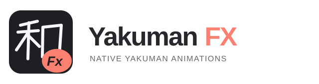

<p align="center">
  <picture>
    <source media="(prefers-color-scheme: dark)" srcset="assets/banner-dark.svg">
    
  </picture>
</p>

<p align="center"><b>Bring native yakuman animations to Mahjong Soul in your browser.</b></p>

<p align="center">
  <a href="https://github.com/Chaldeaaa/yakuman-fx/releases"></a>
  
  <a href="LICENSE"></a>
  
</p>

<p align="center"><b>English</b> · <a href="README.zh-CN.md">简体中文</a></p>

<p align="center"><a href="https://github.com/Chaldeaaa/yakuman-fx/releases"><b>Download</b></a> · <a href="docs/INSTALL.md">Installation guide</a> · <a href="https://github.com/Chaldeaaa/yakuman-fx/issues">Report an issue</a></p>

---

Yakuman FX restores the game's built-in Unity effects using the actual winning hand. Install once and enable in the lobby; effects activate automatically on future visits. No Steam client, desktop helper, or command window is required.

> [!WARNING]
> **Account risk:** This is an unofficial client modification, not affiliated with or endorsed by Mahjong Soul or its operators. Using it may violate the game's terms or trigger account restrictions, including suspension or a permanent ban. No account-safety guarantee is provided. Use at your own risk. The software is provided without warranty; see [LICENSE](LICENSE).

## Contents

- [Features](#features)
- [Compatibility](#compatibility)
- [Quick start](#quick-start)
- [Disable and update](#disable-and-update)
- [Troubleshooting](#troubleshooting)
- [How it works](#how-it-works)
- [Development](#development)
- [License](#license)

## Features

| Native effects | Install once | Easy to control |
| :---: | :---: | :---: |
| Flying tiles and yakuman animations driven by the real completed hand. | Activate from the lobby once; future game loads enable automatically. | Restore Default disables activation; Settings offers Light, Dark, or System themes. |

> [!NOTE]
> Official resources are verified locally. Unknown client builds are left unpatched.

---

## Compatibility

| Game entry | Client build | Validation |
| --- | --- | --- |
| [Chinese-language entry](https://game.maj-soul.com/1/) | `chs_t-WebGL-release-4.0.47(47)` | Startup verified in isolated Edge; replay playback confirmed by the user |
| [International entry](https://mahjongsoul.game.yo-star.com/) | `en-WebGL-release-4.0.10(11)` | Framework and ASTC/DXT cores verified; isolated Edge startup verified; regional replay playback awaiting user validation |
| [Japanese entry](https://game.mahjongsoul.com/) | `jp-WebGL-release-4.0.12(13)` | Framework and ASTC/DXT cores verified; isolated Edge startup verified; regional replay playback awaiting user validation |

The build above is the Unity framework identifier, not the lobby's content-update number. Compatibility also depends on pinned SHA-256 resource checks; a matching version label alone is insufficient. Game updates may require an extension update. See [client compatibility details](docs/COMPATIBILITY.md).

Chrome and Edge desktop are the intended browsers, with Chromium 118 or later. Edge startup has been tested; equivalent Chrome playback testing remains pending. Live-match animation entry is enabled, but live-match playback and broader yakuman/audio coverage remain untested. Mobile browsers, Firefox, and desktop game clients are outside this distribution.

## Quick start

**Download → Extract → Load unpacked → Enable in the lobby**

1. Download and extract `yakuman-fx-v0.2.11.zip` from [Releases](https://github.com/Chaldeaaa/yakuman-fx/releases). If no release is available yet, download this repository and use its `extension/` folder.
2. Open `edge://extensions` or `chrome://extensions` and turn on **Developer mode**.
3. Click **Load unpacked** and select the folder containing `manifest.json`.
4. Open a supported game entry, stay in the lobby, and click **Enable & Reload** in the extension popup.
5. Confirm the lobby reminder and wait for **Native effects loaded. Debugging disconnected.**

> [!IMPORTANT]
> Keep the extracted folder in place. **Never reload during a live match.**

Future game loads activate automatically. No Node.js, Python, or local server is needed. Browser developer-mode reminders may appear.

See the step-by-step [installation guide](docs/INSTALL.md) for folder selection, first activation, updates, and removal. This project is distributed outside browser extension stores.

## Disable and update

**Language:** Click the gear in the popup's upper-right corner, then choose **English** or **简体中文** in Settings. Choose Light, Dark, or System under Theme. Preferences are saved and apply to both the popup and settings page.

**Disable:** Click **Restore Default**, then reload in the lobby to remove the patch already loaded into the page. To uninstall, remove the extension in the browser's extension manager and reload the game.

**Update:** Close the game, replace the extension files in the same installed folder with the new release, click the extension's **Reload** button in the browser extension manager, then reopen the game. Updates are manual.

## Troubleshooting

| Symptom | What to do |
| --- | --- |
| Browser says the tab is being debugged | Expected during startup. The extension disconnects after verified loading. Opening DevTools or canceling the notice early may interrupt activation. |
| “Temporary hook installed” stays visible | Installation alone does not confirm activation. Inspect saved diagnostics in **Extension options** and retry from the lobby. |
| Resource checksum or unsupported-framework error | The client/cache may differ from the pinned build. Leave it unpatched and check for an extension update. Include saved diagnostics in a bug report. |
| “Cannot access a chrome-extension:// URL of different extension” | Another extension's frame may block attachment. Try a separate browser profile containing only Yakuman FX. |
| No animation despite successful loading | Report the browser/version, server entry, replay details, and diagnostics. Other yakuman and live matches are not fully validated. |

Diagnostics are available through the browser extension manager's **Options** / **Extension options** entry; viewing them does not reconnect the debugger. Do not post credentials, authentication tokens, or browser profiles in issues.

## How it works

The inspected WebGL client retains its native yakuman controller but disables the animation entry and skips its resource group. Yakuman FX restores those paths and corrects the flight audio channel. The controller supplies the actual completed hand; this is not video playback.

The extension validates the official framework and presentation bundle, makes three length-preserving script edits locally, and redirects verified reads into Unity's temporary virtual filesystem. Original persistent cache writes remain unchanged. Unknown resources are rejected rather than patched speculatively.

There is no analytics, advertising, telemetry service, or developer-operated server. Official resources are downloaded from the game's origin or official resource CDN and processed locally. The extension does not intercept game WebSocket messages or intentionally read account credentials. This does not guarantee account safety. See [Privacy](PRIVACY.md) for permissions and data handling.

## Development

Requires Node.js 22 or later for tests:

```sh
npm test
```

Tests cover LZ4 decoding, UnityFS reconstruction, resource checks, signed-byte cache verification, navigation scope, and restoration. Automated checks do not replace animation and audio playback testing.

## License

Original project code is licensed under [GPL-3.0-only](LICENSE). When distributing modified versions, follow the GPL's source and license requirements. The license does not grant rights to Mahjong Soul's proprietary code or assets, which belong to their respective owners.

Only the public browser extension is distributed here. Private desktop integrations, extracted game scripts, repacked bundles, Steam assets, and account data are excluded.

